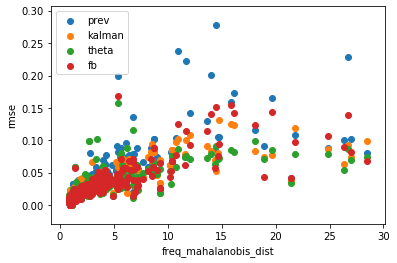
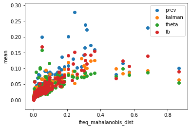
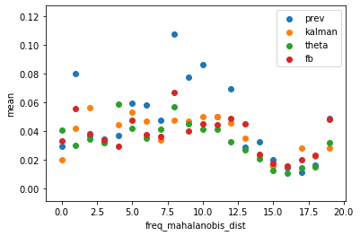

# Booking Demand Prediction
A solution to Grab's AI for SEA competition

## Requirements
### Environment
- Linux (Prediction in `10 - Final Solution - Booking Demand Prediction.ipynb` utilizes parallelism which doesn't work on Windows)
### Language
- Python 3.6+
### Libraries
- jupyter
- pygeohash
- simdkalman
- sklearn
- scipy==1.2
- statsmodels
- pystan
- fbprophet
- tensorflow==2.0.0-alpha0

## Instructions
NOTE: You only need to run 10 - Final Solution - Booking Demand Prediction.ipynb. The other notebooks just explain the methodology behind the solution.

### Install the necessary libraries
```{bash}
pip3 install -r requirements.txt
```
or:
```{bash}
pip3 install pygeohash simdkalman sklearn scipy==1.2 statsmodels pystan fbprophet tensorflow==2.0.0-alpha0 --upgrade
```
Note that you can also do it inside the jupyter notebooks by adding ! right before the commands:
```{bash}
!pip3 install pygeohash simdkalman sklearn scipy==1.2 statsmodels pystan fbprophet tensorflow==2.0.0-alpha0 --upgrade
```

### Open the notebooks using jupyter
First, open jupyter using:
```{bash}
jupyter notebook
```
This will open a window in your browser. From there, open 10 - Final Solution - Booking Demand Prediction.

If you haven't installed jupyter yet, just enter the following to your commandline:
```{bash}
pip3 install jupyter
```
### Running the cells
Focus on the desired cell to run and hold shift then enter. It is recommended to run the cells in order as presented.

And viola, done!

## Methodology
### On the use of hyperlocal forecasting
In hyperlocal forecasting, we need to fit a model for each timeseries (by location). On the other hand, we only need a single spatiotemporal model for all of them. So why use hyperlocal models? For better accuracy.

The following are the errors for the spatiotemporal models:

**Models** | **RMSE**
--- | ---
1st degree polynomial regressor | 0.048594363494371254
2nd degree polynomial regressor | 0.04912314854368942
3rd degree polynomial regressor | 0.0495815584173599
Random Forest | 0.07614693023190335
XGBoost | 0.04855022108270493
Neural Network | 0.049747

While the following are the errors for the hyperlocal models:

**Models** | **RMSE**
--- | ---
FBProphet | 0.03973981575859182
Theta Method | 0.035792962736291206
Kalman Filter | 0.03900183400744959

For more information, please check out notebooks `4` to `8`

### On the 

### On the models used
#### FBProphet
https://facebook.github.io/prophet/docs/quick_start.html
#### Kalman Filter
https://simdkalman.readthedocs.io/en/latest/
#### Theta Method
Please check out the journal articles in the `journal` folder. The researcher found the paper `The Optimized Theta Model` very enlightening.

### On why SARIMA wasn't used
The period of the cycles are of length `96`. This is way too large for SARIMA, making it slow.

### On the use of simple weighing for ensembling
Apparently, the mahalobis distance of the frequencies, demand mean, and time of the day of the timeseries doesn't affect the RMSEs that much. See the following plots (sorry for the misleading labels!):

RMSE vs. Mahalanobis Distance of the Frequencies



RMSE vs. Demand Mean



RMSE vs. Time of the Day



Thus, no external variables were used. For robustness, HuberRegression was used to determine the weights of the predictions.

Simple averaging also works well. In fact, it works 0.36% better than using the weights found using HuberRegression. The weights were used anyway since they are proportional to the models' performance.

**Models** | **RMSE** | **Weight**
--- | --- | ---
FBProphet | 0.03973981575859182 | 0.29395973
Theta Method | 0.035792962736291206 | 0.38132017
Kalman Filter | 0.03900183400744959 | 0.309658

For more information, please check out `9 - Ensembling.ipynb`
